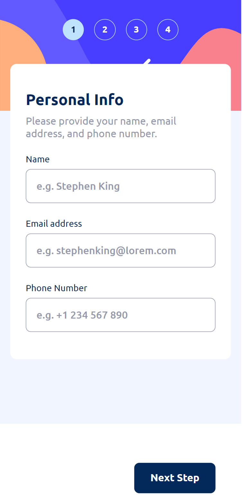
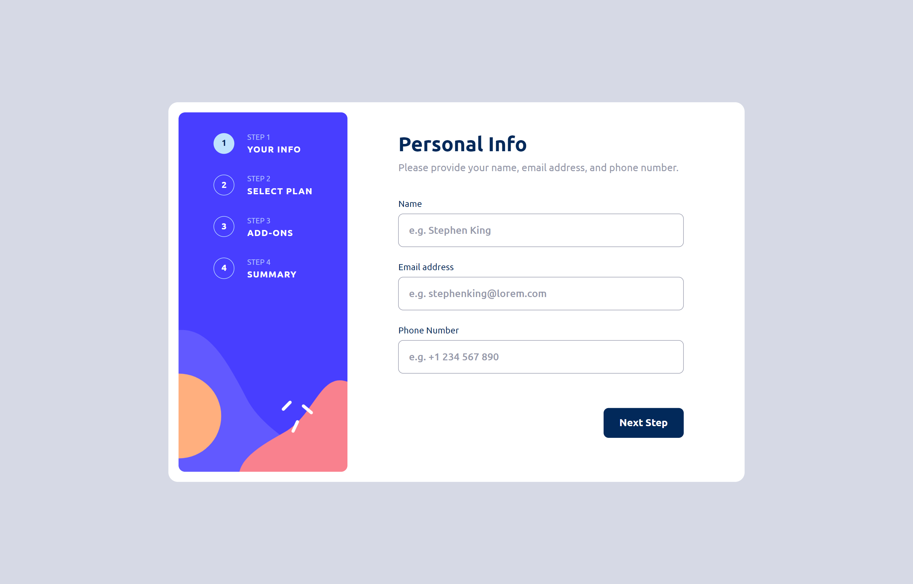

# Frontend Mentor - Multi-step form solution

This is a solution to the [Multi-step form challenge on Frontend Mentor](https://www.frontendmentor.io/challenges/multistep-form-YVAnSdqQBJ). Frontend Mentor challenges help you improve your coding skills by building realistic projects.

## Table of contents

- [Overview](#overview)
  - [The challenge](#the-challenge)
  - [Screenshot](#screenshot)
  - [Links](#links)
- [My process](#my-process)
  - [Built with](#built-with)
  - [What I learned](#what-i-learned)
  - [Continued development](#continued-development)
  - [Useful resources](#useful-resources)
- [Author](#author)
- [Acknowledgments](#acknowledgments)

## Overview

### The challenge

Users should be able to:

- Complete each step of the sequence
- Go back to a previous step to update their selections
- See a summary of their selections on the final step and confirm their order
- View the optimal layout for the interface depending on their device's screen size
- See hover and focus states for all interactive elements on the page
- Receive form validation messages if:
  - A field has been missed
  - The email address is not formatted correctly
  - A step is submitted, but no selection has been made

### Screenshot




### Links

- Solution URL: [Solution URL here](https://github.com/Memeena/multi-step-form-app)
- Live Site URL: [Live site URL here](https://memeena.github.io/multi-step-form-app/)

## My process

### Built with

- Semantic HTML5 markup
- CSS custom properties
- Flexbox
- CSS Grid
- Desktop-first workflow
- [React](https://reactjs.org/) - JS library

### What I learned

My approach towards this challenge:

- I first made a [code-flow design](./code-design.png).
- Used the useReducer hook to frame the logic and implemented the same.
- Created a data file having the plan details.
- The state variables used are plan,selectedPlan,selectedPlanName,selectedPlanAmount,selectedAddOns,currStep, error.
- By using useReducer hook following actions are implemented.
  1. When the user changes the plan from monthly/yearly - updates the plan state variable throughout the code
  2. When the user selects a plan, the related details are fetched from data file and updated in the UI and the selected plan is stored in a state variable to use it in the Summary page.
  3. When the user selects Addons, the related details are stored in the state variable and used in the Summary page.
  4. When the user clicks the GoBack button, the useReducer hook saves the details from the page and updates if any changes are made.
  5. When the user clicks the NextStep button, the useReducer hook saves the details from the page to use it in the Summary page.
  6. When the user clicks the Change Plan button the Summary page, it goes to the Plan Details page and updates any changes made by the user.
  7. When the user clicks the confirm button in the Summary Page, it takes it to the next and final step of Thank You page.
- Minor changes like changing the price fields from '/mo' to '/yr' and viceversa are taken care of as per user requirements.
- Errors from the form are handled in the Personal Details page and displayed in the UI.
- Errors when user selects no plan / addOns are handled by state variable and displayed in the UI if any.
- The total amount of the plan is calculated using array 'reduce' method.

```js
const totalAmt =
  selectedPlanAmount +
  selectedAddOns.reduce((acc, curr) => acc + curr.price, 0);
```

## Author

- Frontend Mentor - [@Memeena](https://www.frontendmentor.io/profile/Memeena)
- Twitter - [@Mekrish18](https://www.twitter.com/Mekrish18)
